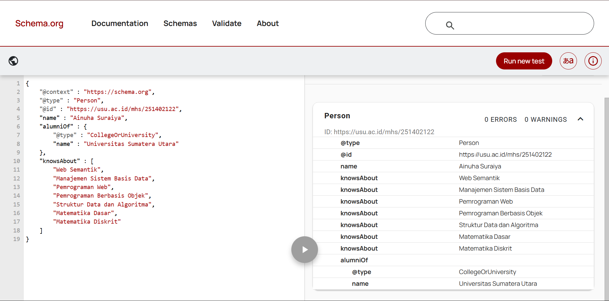
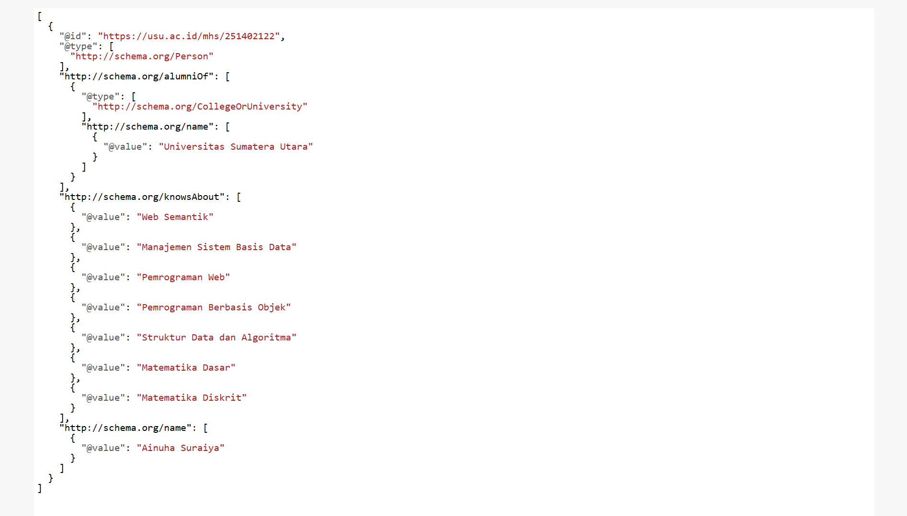
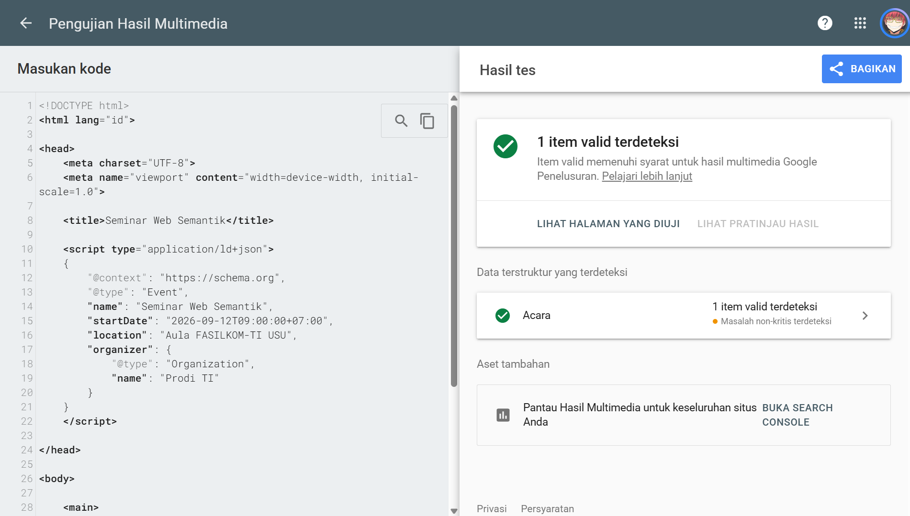

# Latihan Pertemuan 3 - JSON-LD dan Structured Data

## Identitas
- Nama: ISI_NAMA
- NIM: ISI_NIM

## Struktur Hasil
- `profil_saya.jsonld`
- `profil_perbaikan.jsonld`
- `seminar.html`
- folder `screenshots`

## 1. JSON Biasa dan JSON-LD
1. Perbedaan fungsi kunci: 
    Ada JSON biasa, nama dan pekerjaan hanya berfungsi sebagai kunci untuk menyimpan data dan maknanya bergantung pada orang yang membuat data tersebut. Sedangkan name dan jobTitle pada JSON-LD mengikuti kosakata schema.org, sehingga maknanya sudah memiliki definisi yang dapat dipahami oleh mesin. Jadi, JSON-LD tidak hanya menyimpan data, tetapi juga memberikan makna pada data tersebut.

2. Fungsi `@context`, `@type`, dan `@id`:
    @context berfungsi sebagai kamus yang menghubungkan setiap kunci dalam JSON-LD dengan IRI dari kosakata global, seperti schema.org. @type digunakan untuk menunjukkan jenis entitas yang sedang dijelaskan, misalnya Person untuk menunjukkan bahwa data tersebut merupakan seseorang. Sementara itu, @id digunakan sebagai identitas atau IRI unik dari sebuah node agar entitas tersebut dapat dirujuk dari tempat lain.

3. Node tanpa `@id`: 
    Jika sebuah node tidak memiliki @id, node tersebut tetap dapat digunakan dalam JSON-LD, tetapi tidak mempunyai identitas yang bisa dirujuk secara langsung dari tempat lain. Node seperti ini disebut blank node atau node anonim. Jadi, @id tidak wajib, tetapi sebaiknya digunakan terutama jika data tersebut nantinya akan ditautkan atau dirujuk oleh entitas lain.

## 2. Pemeriksaan schema.org
1. Alasan memilih tipe paling spesifik: Karena tipe yang lebih spesifik membuat makna data lebih jelas dan membuat mesin memahami informasi dengan lebih akurat. Selain itu, kita dianjurkan memilih tipe yang paling spesifik yang masih sesuai dengan entitas yang dimodelkan.
2. Nama properti dan bahasa nilai: Nama properti harus mengikuti schema.org karena schema.org merupakan kosakata atau kamus bersama yang digunakan oleh berbagai mesin pencari dan aplikasi untuk memahami makna data. Namun, nilai dari properti boleh menggunakan bahasa apa pun, termasuk Bahasa Indonesia.
3. Manfaat array pada `knowsAbout`: Array pada knowsAbout digunakan ketika seseorang memiliki lebih dari satu bidang pengetahuan atau keahlian.

## 3. Perbaikan Lima Kesalahan

| No. | Bagian Salah | Alasan | Perbaikan |
|---|---|---|---|
| 1 | `"@type": "person"` | Penulisan tipe harus sesuai dengan schema.org dan memperhatikan huruf besar/kecil. | `"@type": "Person"` |
| 2 | `"birthDate": "12 September 2004"` | Format tanggal belum menggunakan standar ISO 8601. | `"birthDate": "2004-09-12"` |
| 3 | `"nomorInduk"` | Properti tersebut tidak terdaftar dalam schema.org. | `"identifier"` |
| 4 | Koma setelah `"nomorInduk": "221401001",` | Properti terakhir dalam JSON tidak boleh memiliki koma di akhir. | Hapus koma terakhir. |
| 5 | Tanda kutip pada nilai `@context` | JSON harus menggunakan tanda kutip ganda (`"`). | `"@context": "https://schema.org"` |

## 4. Triple dari JSON-LD Playground
Tuliskan satu baris N-Quads yang terbentuk:

```text
ISI_TRIPLE
```

## 5. Hasil Validasi
- Schema Markup Validator: ...
- Rich Results Test: ...
- JSON-LD Playground: ...

## 6. Refleksi
1. Mengapa `@context` disebut jembatan menuju makna?
2. Apa perbedaan fungsi Schema Markup Validator dan Rich Results Test?
3. Mengapa isi JSON-LD harus sama dengan konten yang terlihat pada halaman?

## Bukti


