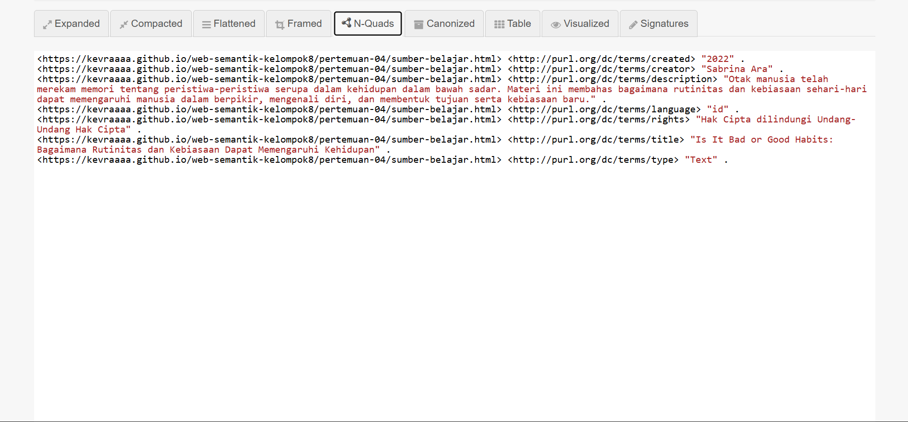
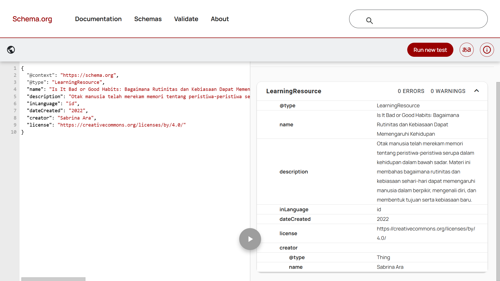

# Pertemuan 4 — Metadata dan Interoperabilitas

## Identitas sumber
- Judul : Is It Bad or Good Habits : Bagaimana Rutinitas dan Kebiasaan Dapat Memengaruhi Kehidupan
- Pembuat : Sabrina Ara
- URI sumber : (https://kevraaaa.github.io/web-semantik-kelompok8/pertemuan-04/sumber-belajar.html)
- Jenis sumber : Text
- Deskripsi : Otak manusia telah merekam memori tentang peristiwa-peristiwa serupa dalam kehidupan di alam bawah sadar dimana itu terbentuk dalam rutinitas yang dijalani sehari-hari, yakni kebiasaan. Oleh karena itu, buku ini membahas bagaimana proses manusia berpikir, mengenali diri, dan melangkah dari kebiasaan kecil hingga pada kebiasaan-kebiasaan yang membawa kesuksesan untuk membentuk tujuan baru, kebiasaan baru, serta mengubah jalan yang lama.
- Tanggal : 2022
- Bahasa : id
- Hak : Hak Cipta dilindungi Undang-Undang Hak Cipta
- ISBN : 978-623-97672-3-5

## Pemetaan Dublin Core Terms
| Properti | Nilai | Alasan pemilihan |
| --- | --- | --- |
| dcterms:title | Is It Bad or Good Habits: Bagaimana Rutinitas dan Kebiasaan Dapat Memengaruhi Kehidupan | Digunakan untuk menunjukkan identitas buku secara unik. |
| dcterms:creator | Sabrina Ara | Digunakan untuk menunjukkan pihak yang membuat atau menulis buku agar jelas siapa yang bertanggung jawab atas isi buku ini. |
| dcterms:description | Otak manusia telah merekam memori tentang peristiwa-peristiwa serupa dalam kehidupan di alam bawah sadar dimana itu terbentuk dalam rutinitas yang dijalani sehari-hari, yakni kebiasaan. Oleh karena itu, buku ini membahas bagaimana proses manusia berpikir, mengenali diri, dan melangkah dari kebiasaan kecil hingga pada kebiasaan-kebiasaan yang membawa kesuksesan untuk membentuk tujuan baru, kebiasaan baru, serta mengubah jalan yang lama. | Memberikan ringkasan isi buku agar pengguna memahami topik yang dibahas. |
| dcterms:created | 2022 | Menunjukkan tahun terbit sebagai penanda kapan buku pertama kali diterbitkan. |
| dcterms:type | Text | Menunjukkan bahwa sumber yang dideskripsikan berupa teks atau buku, bukan gambar, video, atau jenis media lain. |
| dcterms:language | id | Menunjukkan bahasa yang digunakan dalam buku, yaitu Bahasa Indonesia. |
| dcterms:rights | Hak Cipta dilindungi Undang-Undang Hak Cipta | Menjelaskan bahwa buku ini punya perlindungan hukum dan tidak bebas digandakan sembarangan. |

## Hasil validasi
## Hasil validasi
- JSON-LD Playground: Validasi berhasil tanpa galat dan URI subjek cocok. 
  
- Schema Markup Validator: Validasi berhasil dengan 0 ERRORS.
  

## Refleksi
1. Mengapa URI yang sama penting untuk Turtle dan JSON-LD?
karena URI di sini gunanya sebagai identitas unik (seperti nomor KTP) untuk suatu objek di internet. Penggunaan URI yang sama pada format Turtle dan JSON-LD sangat penting supaya browser bisa memahami bahwa kedua file tersebut mendeskripsikan satu materi belajar yang sama, bukan dua materi yang beda.
2. Apa perbedaan peran DC Terms dan schema.org pada pekerjaan ini?
- DC Terms (Dublin Core): Berperan sebagai metadata deskriptif umum (misalnya judul, pencipta, tanggal) untuk kebutuhan pengarsipan dokumen.
- Schema.org: Menyediakan struktur data spesifik (contohnya tipe LearningResource) agar materi lebih mudah dibaca dan diindeks oleh mesin pencari modern seperti Google.
3. Sebutkan satu risiko jika metadata HTML, Turtle, dan JSON-LD tidak konsisten.
Risiko Inkonsistensi Data:
- Kebingungan pada Parser / Mesin Pencari: Jika data di HTML berbeda dengan JSON-LD (misalnya nama pembuat tidak sinkron), sistem kesulitan menentukan data yang valid.
- Gagal Indeks: Informasi berpotensi tidak tampil dengan benar di hasil pencarian Google (Search Engine).
- Penolakan Sistem: Data bisa ditolak oleh sistem pengarsipan otomatis karena dianggap tidak konsisten.

## Catatan akhir
Berdasarkan pengecekan manual pada kode HTML meta, Turtle, dan JSON-LD, seluruh metadata udah dipastikan konsisten. semua informasi utama(judul, pembuat, deskripsi, tanggal, bahasa, dan hak cipta) ada maknanya dan nilai data yang sama di tiga format itu, supaya datanya bisa saling nyambung dan kebaca dengan lancar di platform mana saja.